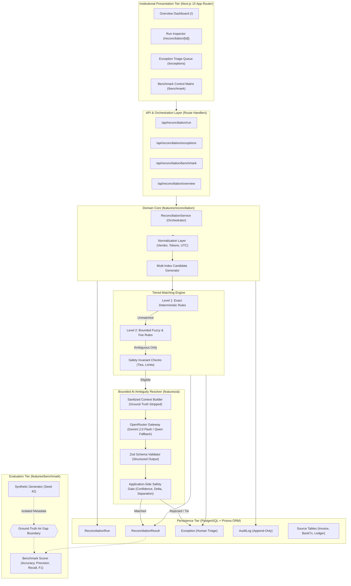
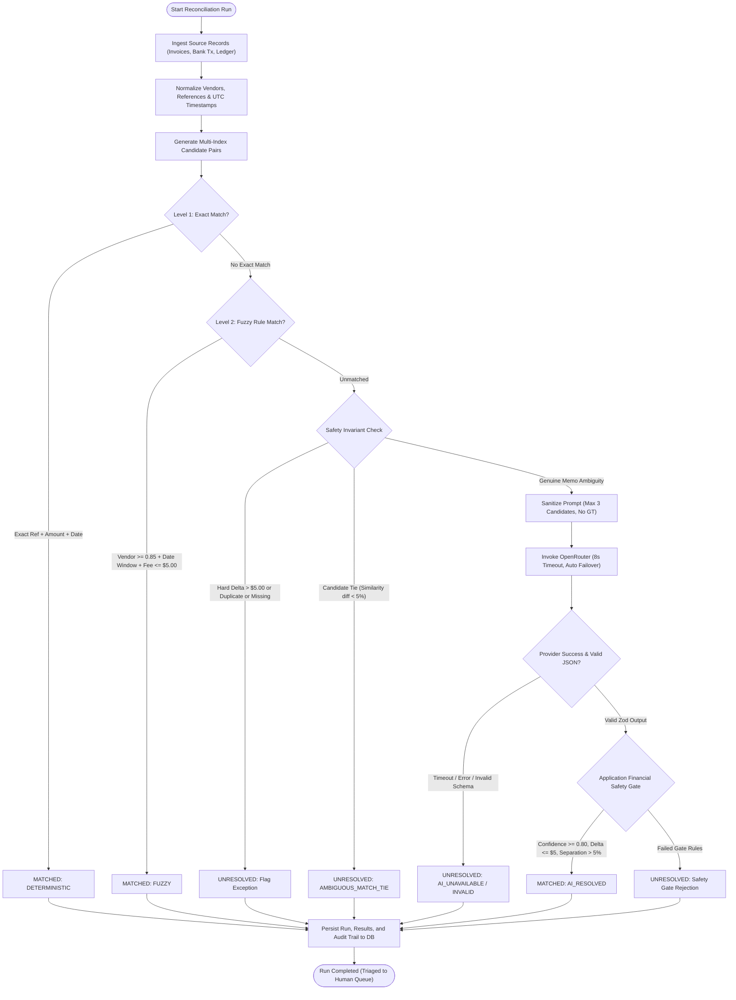
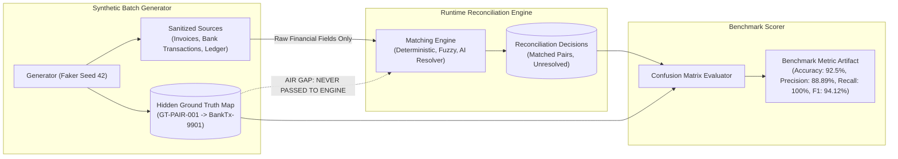

# LedgerGuard: System Architecture Design

LedgerGuard is an institutional finance-ops workstation engineered for multi-source reconciliation across invoices, bank transactions, and general ledger journal entries. It implements a deterministic-first engine with strictly bounded AI disambiguation and auditable human-in-the-loop exception triage.

---

## 1. High-Level System Architecture

---

## 2. Detailed Reconciliation Pipeline Flow

---

## 3. Ground Truth Isolation & Benchmark Evaluation Boundary

To prevent synthetic data leakage and ensure scientific evaluation integrity, LedgerGuard maintains a strict architectural air-gap between ground truth metadata and the matching engine:

---

## 4. Key Architectural Pillars

### 1. Deterministic-First Philosophy
- **Zero AI on clear paths**: Exact reference, amount, and date matches are resolved deterministically in microseconds with zero LLM operational overhead or latency.
- **Immutable outcomes**: Once a record matches deterministically, downstream heuristics and LLMs are never permitted to alter or re-evaluate the decision.

### 2. Guarded AI Disambiguation
- **Isolation to genuine ambiguity**: AI is invoked only when candidate options are available but heuristics cannot distinguish truncated memos or naming variations.
- **Strict Hard Exclusions**: Hard amount mismatches ($> \$5.00$), missing records, and lookalike ties are held as `UNRESOLVED` without burning LLM tokens.
- **Application-Side Safety Gate**: Even if an LLM asserts 100% confidence, the application verifies:
  1. Selected ID belongs to the supplied candidate set.
  2. Currency identity is preserved.
  3. Fee delta $\le \$5.00$.
  4. Date window within $[-5, +30]$ days.
  5. Top-candidate separation margin $> 5\%$.

### 3. Human-in-the-Loop Exception Triage
- Every record that fails matching or gate checks is categorized into an explicit financial exception category (`AMOUNT_MISMATCH`, `DATE_MISMATCH`, `AMBIGUOUS_MATCH`, `DUPLICATE`, `MISSING_RECORD`, `INSUFFICIENT_EVIDENCE`).
- Human controllers can inspect source evidence side-by-side and execute signed override decisions with append-only audit trail logging.
